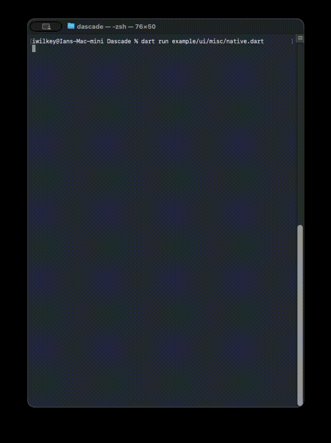
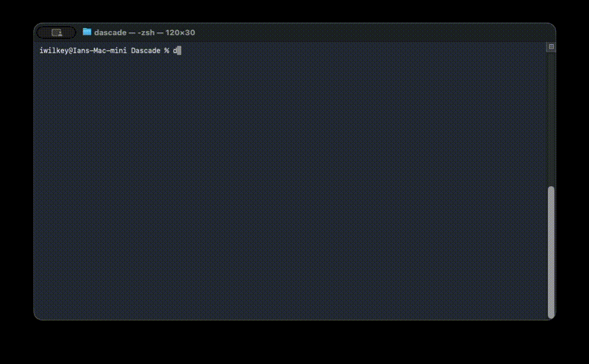
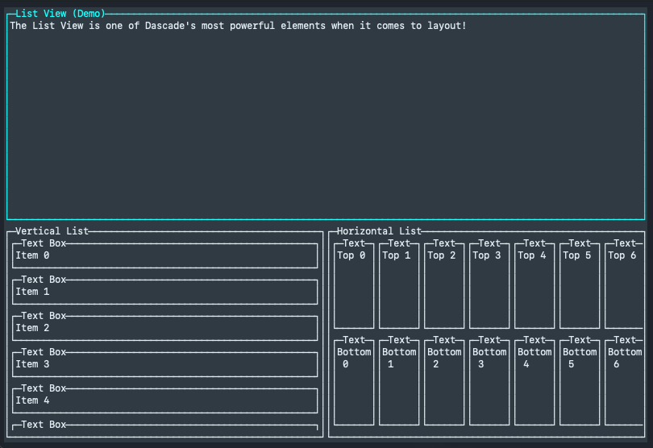
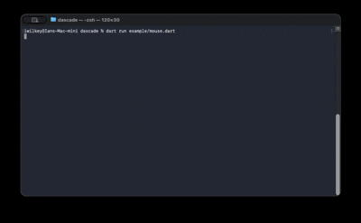
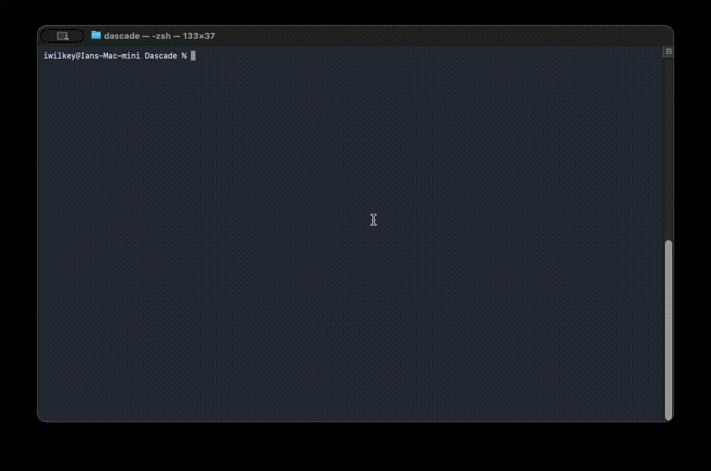
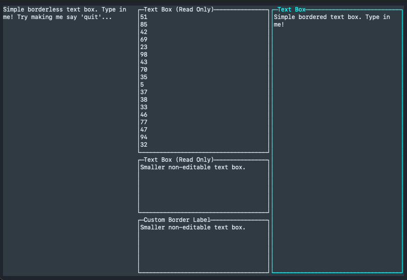
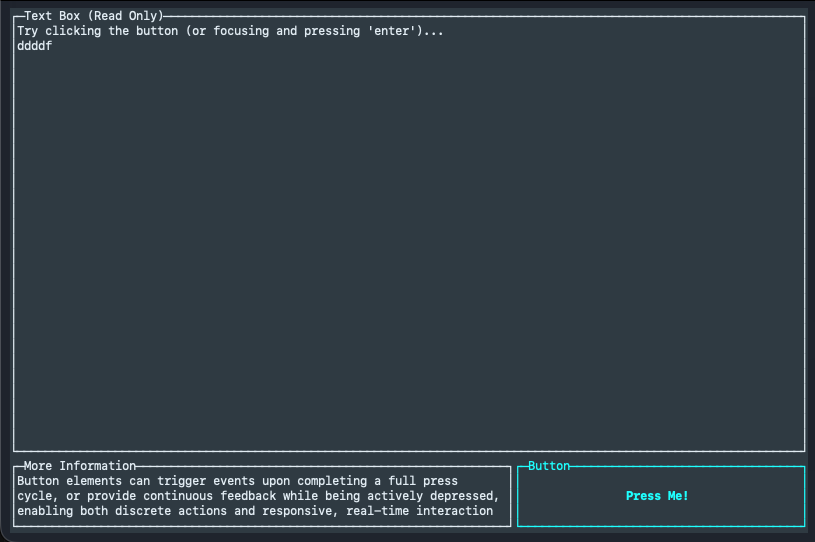
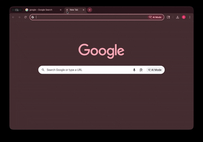

# Dascade
## The Dart ASCII Console Application Development Environment

Need a TUI? 
Don't want to manage a native window? 
Like Dart? 
Me too.

Enter Dascade: an experimental, immediate-mode TUI framework for Dart focused on determinism, performance, and portability.

<p align="center">
  
</p>

**Dascade** (Dart ASCII Console Application Development Environment) is an experimental, immediate‑mode TUI (Terminal User Interface) framework for Dart.

It is designed to be **lightweight, deterministic, and portable**, enabling developers to build rich terminal applications without retained widget trees, implicit layout passes, or hidden state.

Dascade is performant enough to support real-time animations and advanced ASCII graphics, including software-rendered 3D/2D scenes rendered directly in the terminal.

For example, debugging an A* implementation becomes far more intuitive when the algorithm’s internal state is rendered directly to the terminal.

With Dascade, we can visualize the open sets, closed sets, and the final path as the algorithm runs — making correctness and performance issues immediately obvious.

<p align="center">
  
</p>

---

## Project Status

⚠️ **EXPERIMENTAL — ACTIVE DEVELOPMENT**

Dascade is usable today, but APIs are still evolving.  
Breaking changes may occur as the architecture is refined.

The core systems — rendering, layout, input, and widgets — are already functional and exercised by real examples.

---

## Core Philosophy

Dascade is built around the following principles:

### Immediate‑Mode UI
- UI is described every frame
- No widget lifecycles or retained trees
- Application state lives in *your code*, not inside widgets

<p align="center">
  
</p>

### Deterministic Layout
- Layout assigns concrete `DURect`s
- UI elements **trust the rect they are given**
- Elements never perform layout calculations themselves

### Buffered + Differential Rendering
- Rendering is double‑buffered
- Only changed cells are emitted to the backend
- Optimized for native terminals, with fallback modes

### Input

- Keyboard input is supported in all environments
- Mouse input is supported in ANSI-capable terminals and in the web backend
- Platform-specific input details are normalized by the backend

<p align="center">
  
</p>

### Minimal Dependencies
- Uses `dart_console` for native terminal I/O
- ANSI behavior implemented internally where practical
- No heavy runtime abstractions

### Cross‑Platform by Design
- macOS, Linux, Windows terminals
- Experimental web backend via software terminal emulation

---

## Features

- Immediate‑mode UI API
- Deterministic layout engine
- Buffered rendering with diffing
- ANSI color and style support
- Keyboard input (cross‑platform)
- Mouse input (ANSI SGR / X10)
- Optional element borders
- Native terminal backend
- Experimental web backend

See below Snake running in Dascade. (I mean, it's staple right?)

<p align="center">
  
</p>

---

## Performance

Thanks to buffered, line-based differential rendering and 256-color ANSI support, Dascade is performant enough to support real-time animations and advanced ASCII graphics, including software-rendered 3D/2D scenes displayed directly in the terminal.

---


## Installation

Dascade is a **Dart library** distributed through the Dart package manager, `pub`.
If you are new to Dart, this section walks through the basics before installing Dascade.

---

### Prerequisites

To use Dascade, you need:

- Dart SDK (stable)
- A terminal environment (macOS, Linux, or Windows)

You can verify Dart is installed by running:

```
dart --version
```

If Dart is not installed, follow the official installation guide:
https://dart.dev/get-dart

---

### Creating a Dart Project

If you do not already have a Dart project, create one:

```
dart create my_app
cd my_app
```

This will generate a standard Dart project structure, including a
`pubspec.yaml` file where dependencies are declared.

---

### Adding Dascade

Open your `pubspec.yaml` file and add Dascade under `dependencies`:

```
dependencies:
  dascade: ^0.x.x
```

> Version numbers are subject to change while Dascade is experimental.

Then fetch dependencies:

```
dart pub get
```

---

### Importing Dascade

Once installed, you can import Dascade in your Dart source files:

```dart
import 'package:dascade/dascade.dart';
```

You are now ready to build terminal UIs with Dascade.

---

### Running Your App

Most Dascade applications are run directly from the terminal:

```
dart run
```

For best results:
- Use a modern terminal with ANSI support
- Avoid terminals that aggressively redraw or buffer output

---

## Example Usage

```dart
library;

import 'package:dascade/dascade.dart';

Future<void> main() async {

  /// Dascade always requires the following framework entry point!
  await Dascade.run((d) async {

    /// Application run state.
    bool running = true;

    // Dascade UI works by creating UI elements with persistent state outside the main loop.

    final DUTextBox text = DUTextBox(
      borderLabel: "List View (Demo)",
      initialText: "The List View is one of Dascade's most powerful elements when it comes to layout!",
      border: true,
      editable: false,
    );

    final DUList vlist = DUList(border: true, borderLabel: "Vertical List");
    final DUList hlist = DUList(border: true, borderLabel: "Horizontal List", horizontal: true);

    /// Dascade is an immediate-mode framework so an application loop is essential for
    /// proper usage.
    while(running) {

      /// It's always a good idea to have a clean application exit strategy!
      if(d.escape) running = false;

      /// Dascade requires beginFrame() before you issue any draw calls or UI!
      d.beginFrame();
      
      /// If you're going to have UI this frame, you must always supply a root()!
      d.ui.root(
        /// Define layout here.
        d.ui.column([
          /// Have a text box take up the top half of the screen.
          text,
          /// Have the two lists side-by-side on the bottom half of the screen.
          d.ui.row([
            /// Show a vertical list of 32 different text box elements.
            vlist.show(
              [
                for(int i = 0; i < 32; i++) 
                  DUTextBox(
                    initialText: "Item $i",
                    border: true,
                    editable: true,
                  )
              ], itemSize: 3
            ),
            /// Show a horizontal list of 64 different text box elements, laid out in a column themselves.
            hlist.show(
              [
                for(int i = 0; i < 32; i++) ...[
                  d.ui.column([
                    DUTextBox(
                      initialText: "Top $i",
                      border: true,
                      editable: true,
                    ),
                    DUTextBox(
                      initialText: "Bottom $i",
                      border: true,
                      editable: true,
                    ),
                  ], layout: DULayout.equal())
                ]
              ], itemSize: 8
            ),

          ], layout: DULayout.equal())
        ], layout: DULayout.equal())
      );
      
      /// Dascade always requires an explicit endFrame() to flush drawn elements to the screen!
      d.endFrame();

      /// It's always a good idea to throttle the frame rate!
      await Future.delayed(const Duration(milliseconds: 16));
    }
  });

}
```

Dascade uses a **frame loop model**.  
UI is rebuilt every frame based on current application state.

---

## Layout System

Dascade layouts live in `ui/elements/layout` and are fully explicit.

Currently provided:

- `DUListLayout` (horizontal / vertical)
- `DUSpacer`

Layout behavior:
- Best‑effort when space is constrained
- Gaps collapse before elements are dropped
- Overflowed elements receive zero‑sized rects

Layout assigns `DURect`s; elements render within them.

---

## UI Elements (Current)

Stock elements included in the repository:

### Text
- Static text rendering
- ANSI color support

### TextBox
- Editable and read‑only modes
- Optional borders
- Keyboard input handling

<p align="center">
  
</p>

### Button
- Clickable via keyboard or mouse
- Immediate‑mode interaction state

<p align="center">
  
</p>

### Radio Button
- Mutually exclusive selection
- Stateless rendering, external state control

### Dropdown
- Expandable selection list
- Keyboard and mouse interaction

### Native / Misc
- Native terminal information elements
- Debug / inspection helpers

All UI elements:
- Accept a `border` flag
- Render only within their assigned rect
- Maintain no hidden global state

---

## Input Model

Dascade exposes immediate‑mode input state:

- `down`
- `justDown`
- `justUp`

Supported input:
- Keyboard (mirrors `dart_console` behavior)
- Mouse (ANSI SGR 1006 and X10)

Input parsing is backend‑agnostic and normalized.

---

## Rendering Model

Rendering is cell‑based:

- `_next` buffer represents desired frame
- `_current` buffer represents terminal state
- Diffing emits only changed cells (unless disabled)

Backends:
- Native terminal renderer
- Web software terminal emulator/renderer (experimental)

Resize events trigger full buffer re‑sync.

---

## Naming Conventions

Dascade enforces strict naming conventions:

- Core engine types: `D*`
- UI types: `DU*`
- Geometry: `DURect`, etc.

Examples:
- `DRenderer`
- `DascadeBuffer`
- `DUButton`
- `DUTextBox`

These conventions are intentional and required for contributions.

---

## Examples

The repository includes working examples:

- Button demo
- Radio buttons
- Dropdowns
- TextBox editing
- Mouse interaction demo
- Snake game
- Maze demo
- ASCII donut
- Immediate‑mode UI samples

Examples live in the `example/` directory and double as regression tests.

---

## Web-Based Development (Experimental)

<p align="center">
  
</p>

Dascade includes **experimental support for running applications in the browser**.
This allows the same immediate-mode UI code used for native terminals to be rendered
inside a web page via a software-emulated terminal backend.

⚠️ Web support is **experimental** and under active development.
APIs, performance characteristics, and rendering behavior may change.

---

### Overview

The repository contains a `web/` directory that demonstrates how to run a Dascade
application on the web.

The web backend works by:
- Compiling your Dart application to JavaScript
- Rendering the terminal grid manually in the browser
- Forwarding input events to Dascade’s existing input system

This is **not** a native terminal emulator and does not rely on `<canvas>` or DOM text nodes.
All rendering is handled by Dascade’s web backend.

---

### Project Structure

A minimal web setup consists of:

**`main.dart`**
```dart
import '../example/ui/button/button.dart' as app;

void main() {
  app.main();
}
```

This file simply forwards execution to an existing Dascade example or application.

**`index.html`**
```html
<!DOCTYPE html>
<html>
  <head>
    <meta charset="utf-8">
    <title>Dascade Web</title>
    <style>
      html, body {
        margin: 0;
        padding: 0;
        background: black;
        overflow: hidden;
        width: 100%;
        height: 100%;
      }
    </style>
  </head>
  <body>
    <script src="main.js"></script>
  </body>
</html>
```

This page hosts the compiled Dascade application and provides a full-screen surface
for rendering.

---

### Running the Web Build

From the `web/` directory, the provided workflow is:

```
dart compile js main.dart -o main.js
dart run build_runner serve web:8080
```

Then open your browser and navigate to:

```
http://localhost:8080
```

Your Dascade application should appear and run inside the browser.

---

### Limitations

Current limitations of the web backend include:

- Performance lower than native terminals
- Manual font and cell metric handling
- Incomplete input parity with native backends
- Rendering behavior may differ between browsers

The web backend prioritizes **correctness and portability** over performance.

---

### Contributing to Web Support

Web support is an active area of development, and contributions are welcome.

Helpful areas include:
- Performance optimizations
- Improved input handling
- Font metric and scaling improvements
- Accessibility research
- Backend cleanup and documentation

If you are interested in improving web support, please open an issue or pull request.

---

## FAQ

**Is this a GUI toolkit?**  
No. Dascade is a terminal UI engine.

**Why immediate‑mode?**  
Predictability, simplicity, and performance.

**Does Dascade manage state for me?**  
No. State lives in your application.

**Is web support production‑ready?**  
No. It is experimental.

---

## Contributing

Contributions are welcome, especially in the stock Dascade UI package.

Please:
- Follow naming conventions
- Use clear Dart doc comments
- Avoid hidden state or magic behavior
- Keep APIs explicit and deterministic

PRs that simplify the system are preferred over clever abstractions.

---

## License

Open source under the MIT license. See LICENSE for more information.

---

## Author & Maintainer

**Ian Wesley Wilkey**  

Creator and primary maintainer of Dascade.

Dascade was started as a personal exploration into building a clean,
portable, immediate‑mode TUI framework for Dart.

---
