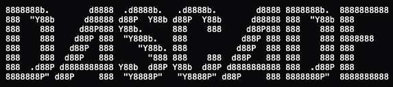

<p align="center">
  
</p>

The **D**art **AS**CII **C**onsole **A**pplication **D**evelopment **E**nvironment

**Dascade** is an experimental, immediate‑mode TUI (Terminal User Interface) framework for Dart.

It is designed to be **lightweight, deterministic, and portable**, enabling developers to build rich terminal applications without retained widget trees, implicit layout passes, or hidden state.

## Table of Contents

- [Why Dascade?](#why-dascade)
- [Project Status](#project-status)
- [Core Philosophy](#core-philosophy)
  - [Immediate-Mode UI](#immediate-mode-ui)
  - [Buffered + Line-Based Differential Rendering](#buffered--line-based-differential-rendering)
  - [Real-time ANSI-based Input](#real-time-ansi-based-input)
  - [Deterministic Layout](#deterministic-layout)
  - [Minimal Dependencies](#minimal-dependencies)
  - [Cross-Platform by Design](#cross-platform-by-design)
- [Features](#features)
- [Performance](#performance)
- [Installation](#installation)
  - [Prerequisites](#prerequisites)
  - [Creating a Dart Project](#creating-a-dart-project)
  - [Adding Dascade](#adding-dascade)
  - [Importing Dascade](#importing-dascade)
  - [Running Your App](#running-your-app)
  - [Compilation and Distribution](#compilation-and-distribution)
    - [macOS](#macos)
      - [Building a Native Binary](#building-a-native-binary)
      - [Notes](#notes)
    - [Linux](#linux)
      - [Building a Native Binary](#building-a-native-binary-1)
      - [Notes](#notes-1)
    - [Windows](#windows)
      - [Building a Native Binary](#building-a-native-binary-2)
      - [Notes](#notes-2)
  - [Distribution Considerations](#distribution-considerations)
- [Dascade API Overview](#dascade-api-overview)
  - [Application Lifecycle](#application-lifecycle)
  - [Immediate-Mode Frame Loop](#immediate-mode-frame-loop)
  - [Drawing Cells Directly](#drawing-cells-directly)
  - [Colors and Styling](#colors-and-styling)
  - [Keyboard Input](#keyboard-input)
  - [Mouse Input](#mouse-input)
  - [Terminal Dimensions](#terminal-dimensions)
  - [UI System Overview](#ui-system-overview)
  - [Layout Containers](#layout-containers)
  - [Lists](#lists)
  - [Text Boxes](#text-boxes)
  - [Buttons](#buttons)
  - [Radio Buttons](#radio-buttons)
  - [Dropdowns](#dropdowns)
  - [Animation and Timing](#animation-and-timing)
  - [Algorithms and Visualization](#algorithms-and-visualization)
  - [Web Backend Usage](#web-backend-usage)
- [Layout System](#layout-system)
- [UI Elements (Current)](#ui-elements-current)
- [Rendering Model](#rendering-model)
- [Naming Conventions](#naming-conventions)
- [Examples](#examples)
- [Web-Based Development (Experimental)](#web-based-development-experimental)
  - [Overview](#overview)
  - [Project Structure](#project-structure)
  - [Running the Web Build](#running-the-web-build)
  - [Web Limitations](#web-limitations)
  - [Contributing to Web Support](#contributing-to-web-support)
- [FAQ](#faq)
- [Contributing](#contributing)
- [License](#license)
- [Author & Maintainer](#author--maintainer)

## Why Dascade?

Often, developers need a text-based user interface that is both portable and predictable. Dascade exists to make it possible to write a TUI once and run it anywhere, in native terminals or on the web, without sacrificing control, performance, or determinism.

With Dascade, you can build interactive applications directly in the terminal, visualize complex systems in real time, and reason about layout and input explicitly. There is no hidden state, no implicit reflow, and no magic.

**For example**: Let's say I want to port a1k0n's donut.c to Dart, and I want to see it's performance with a nice textbox near the bottom of my terminal. See image below.

<p align="center">
  
</p>

**Another example**: Let's say I need to debug an A* implementation before it goes in one of my projects. Using Dascade, I can visualize the open sets, closed sets, and the final path as the algorithm runs — making correctness and performance issues immediately obvious. See image below.

<p align="center">
  
</p>

**How about this**: I need a quick way to create a terminal application that organizes text-based data in a layout and allows interaction through scrollable lists. See image below.

<p align="center">
  
</p>

**Consider**: Building a classic Snake game as a quick programming exercise becomes trivial with Dascade. Arbitrary cell-based drawing and real-time ANSI input allow the entire implementation to fit in roughly 50 lines of code. See image below.

<p align="center">
  
</p>

And anything else you can think of. With Dascade, any terminal becomes your canvas.

## Project Status

**EXPERIMENTAL: ACTIVE DEVELOPMENT**

Dascade is under active development, but is already highly usable and customizable.

**However**: The core systems, rendering, layout, input, and widgets, are highly functional and efficient, exercised by real examples in the example/ directory.

Dascade is designed to be flexible enough that higher-level abstractions can be built on top of the core framework to support a wide range of systems and workflows. While this may involve some boilerplate today, continued development focuses on providing faster, more ergonomic tools for mocking up production-ready applications.

## Core Philosophy

Dascade's features are built around the following principles:

### Immediate-Mode UI
- Draw calls are issued every frame with no implicit state
- UI layout and interaction is described and parsed each frame
- No element/widget lifecycles or retained trees
- **Bottom line**: Application state lives in *your code*, not inside a Dascade-managed state.

### Buffered + Line-Based Differential Rendering
- Rendering is double‑buffered, so **FLICKERING** is **NOT POSSIBLE**.
- Only changed cells are emitted to the backend
- Optimized for native terminals, with fallback modes
- Web-based Canvas 2D terminal and ANSI emulation (experimental)

### Real-time ANSI-based Input

- Keyboard input is supported in all environments
- Mouse input is supported in ANSI-capable terminals and in the web backend
- Platform-specific input details are normalized by the backend

**For example**: Below is a demonstration of ANSI mouse events translated into Dascade’s immediate-mode input API.

<p align="center">
  
</p>

### Deterministic Layout
- The Dascade UI Layout Engine assigns concrete `DURect`s
- UI elements **trust the rect they are given**
- Elements never perform layout calculations themselves

### Minimal Dependencies
- Uses `dart_console` for native terminal I/O
- ANSI behavior implemented internally where practical
- No heavy runtime abstractions

### Cross-Platform by Design
- macOS, Linux, Windows terminals
- Experimental web backend via software terminal and ANSI emulation

## Features

- Immediate-mode primitive draw API
- Immediate‑mode UI API
- Deterministic layout engine
- Line-base buffered rendering with diffing
- ANSI color and style support
- Keyboard input (cross‑platform)
- Mouse input (ANSI SGR / X10)
- Optional element borders
- Native terminal backend with Win32 Virtual Terminal support
- Experimental web backend

## Performance

Thanks to buffered, line-based differential rendering and 256-color ANSI support, Dascade is performant enough to support real-time animations and advanced ASCII graphics, including software-rendered 3D/2D scenes displayed directly in the terminal. Why? Because reasons.

## Installation

Dascade is a **Dart library** distributed through the Dart package manager, `pub`.

**Sidenote: Why Dart?**: Dart may not be the fastest language in every scenario, but it offers excellent support for cross-platform compilation, strong async primitives, and a familiar C-style syntax that makes it well suited for this kind of framework. **TLDR**: In my opinion, Dart is somewhat slept on.

If you are new to Dart, this section walks through the basics before installing Dascade.

### Prerequisites

To use Dascade, you need:

- Dart SDK (stable)
- A terminal environment (macOS, Linux, or Windows)

You can verify Dart is installed by running:

```
dart --version
```

If Dart is not installed, follow the official installation guide: https://dart.dev/get-dart

### Creating a Dart Project

If you do not already have a Dart project, create one:

```
dart create my_app
cd my_app
```

This will generate a standard Dart project structure, including a
`pubspec.yaml` file where dependencies are declared.

### Adding Dascade

Open your `pubspec.yaml` file and add Dascade under `dependencies`:

```
dependencies:
  dascade: ^1.0.0
```

> Version numbers are subject to change while Dascade is experimental.

Then fetch dependencies:

```
dart pub get
```

### Importing Dascade

Once installed, you can import Dascade in your Dart source files:

```dart
import 'package:dascade/dascade.dart';
```

You are now ready to build interactive terminal experiences with Dascade, the rest is just syntax and learning Dascade's API.

### Running Your App

Dascade applications are run directly from the terminal:

```
dart run [path_to_your_projects_main_file].dart
```

For best results:
- Use a modern terminal with ANSI support
- Avoid terminals that aggressively redraw or heavily buffer output. That said, supporting challenging terminal environments is an explicit goal of Dascade’s development. If a particular environment behaves poorly, please open an issue.

### Compilation and Distribution

Dascade applications are standard Dart programs. This means they can be compiled
and distributed using Dart’s built-in tooling without any special handling from
the framework itself.

Below are the recommended workflows for distributing Dascade applications on
each supported desktop platform.

### macOS

On macOS, Dascade applications can be compiled into a standalone native executable using Dart’s AOT compiler.

### Building a Native Binary

From your project root:

```
dart compile exe bin/main.dart -o dascade_app
```

This produces a native executable named `dascade_app`.

You can then distribute this binary directly, or bundle it inside a `.app`
wrapper if desired.

### Notes

- The executable runs in a terminal environment
- Users must launch it from Terminal or a terminal emulator
- ANSI-compatible terminals are recommended

### Linux

Linux builds follow the same process as macOS.

### Building a Native Binary

```
dart compile exe bin/main.dart -o dascade_app
```

The resulting binary can be distributed directly.

### Notes

- Most modern Linux terminals fully support ANSI escape sequences
- Ensure executable permissions are preserved when distributing:
  ```
  chmod +x dascade_app
  ```

### Windows

On Windows, Dascade applications compile to a native `.exe` file.

### Building a Native Binary

```
dart compile exe bin/main.dart -o dascade_app.exe
```

This produces a standard Windows executable.

### Notes

- Windows Terminal is recommended
- Older terminals may require enabling Virtual Terminal processing
- Dascade uses Win32 Virtual Terminal support where available

### Distribution Considerations

Because Dascade applications are terminal-based:

- They are typically distributed as command-line tools
- Installers are optional, not required
- Cross-compilation is not supported; binaries must be built per platform

For cross-platform distribution, it is common to:
- Build binaries on each target platform
- Or distribute source code and allow users to compile locally

## Dascade API Overview

This section introduces the core Dascade API by example. Rather than presenting large, copy-paste programs, it focuses on small, composable snippets that explain *how to think in Dascade*.

All examples are drawn directly from patterns used throughout the `example/`
directory.

### Application Lifecycle

Every Dascade application starts the same way.

```dart
await Dascade.run((DascadeFramework d) async {
  // Application code lives here
});
```

`Dascade.run`:
- Initializes the runtime
- Sets up rendering and input backends
- Owns the terminal lifecycle
- Provides a `DascadeFramework` handle (`d`)

All interaction with Dascade happens through this handle.

### Immediate-Mode Frame Loop

Dascade is an immediate-mode framework. UI and rendering are described every frame inside an explicit loop.

```dart
bool running = true;

while (running) {

  /// Make your application has an exit strategy!
  if (d.escape) running = false;

  d.beginFrame();

  // draw / UI calls here

  d.endFrame();

  /// Make sure to throttle the frame rate to avoid starving the main thread.
  await Future.delayed(const Duration(milliseconds: 16));

}
```

Key points:
- `beginFrame()` must be called before issuing draw or UI calls
- `endFrame()` flushes the frame to the backend
- State lives in your variables, not in the framework

## Drawing Cells Directly

At the lowest level, Dascade renders individual cells.

```dart
d.draw(
  x,
  y,
  DascadeCell.encode(
    glyph: '@'.codeUnitAt(0),
    fg: 46,
    bg: 0,
  ),
);
```

- Coordinates are integer cell positions
- Colors use 256-color ANSI indices
- Rendering is buffered and diffed automatically

### Colors and Styling

Cells are encoded using ANSI color indices.

```dart
final int green = 46;
final int gray  = 240;
final int red   = 196;
```

Foreground and background colors are independent.
No global style state is retained between frames.

### Keyboard Input

Keyboard input is exposed as immediate-mode state.

```dart
if (d.escape) {
  running = false;
}
```

Typical usage:
- Poll keys each frame
- Update application state accordingly
- No event queues or callbacks

### Mouse Input

Mouse input is supported in ANSI-capable terminals and on the web.

```dart
final bool justClicked = d.mouseLeftDown && !previousMouseDown;

previousMouseDown = d.mouseLeftDown;
```

Mouse state includes:
- Button state
- Position
- Frame-accurate transitions

ANSI mouse events are normalized into the same API across platforms.

## Terminal Dimensions

Terminal size is available through the framework handle.

```dart
final int width  = d.width;
final int height = d.height;
```

Important:
- Dimensions are only valid *after* a frame has begun
- Initialization that depends on size should be deferred

This pattern appears in maze and visualization examples.

### UI System Overview

Dascade includes a minimal immediate-mode UI system. UI is optional and layered on top of the renderer.

Every UI frame must begin with a root container.

```dart
d.ui.root(
  d.ui.column([
    // elements
  ]),
);
```

UI elements render into rectangles assigned by layout.
They do not perform layout calculations themselves.

### Layout Containers

Layouts are explicit and composable.

### Columns and Rows

```dart
d.ui.column([
  elementA,
  elementB,
]);

d.ui.row([
  left,
  right,
], layout: DULayout.equal());
```

Layouts:
- Assign `DURect`s to children
- Handle spacing and overflow
- Are deterministic

### Lists

Scrollable lists are provided via `DUList`.

```dart
/// Outside main loop!
final DUList vlist = DUList(border: true, borderLabel: "Vertical List");
final DUList hlist = DUList(border: true, borderLabel: "Horizontal List", horizontal: true);

/// Omitting some other widget initialization here...

/// ... in application loop, between d.beginFrame() and d.endFrame():
d.ui.root(
  /// Define layout here.
  d.ui.column([
    /// Have a text box take up the top half of the screen.
    text,
    /// Have the two lists side-by-side on the bottom half of the screen.
    d.ui.row([
      /// Show a vertical list of 32 different text box elements.
      vlist.show(
        [
          for(int i = 0; i < 32; i++) 
            DUTextBox(
              initialText: "Item $i",
              border: true,
              editable: true,
            )
        ], itemSize: 3
      ),
      /// Show a horizontal list of 64 different text box elements, laid out in a column themselves.
      hlist.show(
        [
          for(int i = 0; i < 32; i++) ...[
            d.ui.column([
              DUTextBox(
                initialText: "Top $i",
                border: true,
                editable: true,
              ),
              DUTextBox(
                initialText: "Bottom $i",
                border: true,
                editable: true,
              ),
            ], layout: DULayout.equal())
          ]
        ], itemSize: 8
      ),

    ], layout: DULayout.equal())
  ], layout: DULayout.equal())
);
```

Lists:
- Can be vertical or horizontal
- Handle clipping and scrolling
- Accept arbitrary child elements

Lists are heavily used in UI examples.

### Text Boxes

Text boxes display and optionally edit text.

```dart
/// Outside of loop...
final DUTextBox text = DUTextBox(
  initialText: "Hello",
  border: true,
  editable: true,
);

/// In your loop, lay it out using Dascade UI's layout engine.
```

Features:
- Editable or read-only
- Optional borders and labels
- Keyboard-driven input

### Buttons

Buttons provide basic interaction.

```dart
/// Outside main loop!
final DUButton button = DUButton(label: "Press Me!", borderLabel: "Button");

/// ... in main loop

/// layout button in a row, column, or list like other UI elements...

if (button.fire) {
  // handle a complete press cycle (up -> down.) This also applies to 'Enter' strikes.
}
/// or...
if(button.down) {
  /// do something while the button is held down.
}

```

Button state is immediate:
- True only on the frame it is activated
- No retained callbacks

### Radio Buttons

Radio buttons model mutually exclusive state.

```dart
/// Outside of loop...
final DURadio radio0 = DURadio(label: 'Option A', border: true, state: false, borderLabel: "Radio");
final DURadio radio1 = DURadio(label: 'Option B', border: true, state: false, borderLabel: "Radio");
final DURadio radio2 = DURadio(label: 'Option C', border: true, state: false, borderLabel: "Radio");
final DURadio radio3 = DURadio(label: 'Option D', border: true, state: false, borderLabel: "Radio");

/// Let's track state over frames to ensure we print only when states change.
bool r0s = false;
bool r1s = false;
bool r2s = false;
bool r3s = false;

/// Omitting some other widget initialization here.

/// ... in application loop, between d.beginFrame() and d.endFrame():
d.ui.root(
  d.ui.column(
    <DUElement>[
      text,
      d.ui.row([
        d.ui.column([
          radio0,
          radio1,
          radio2,
          radio3
        ], layout: DULayout.equal()),
        info
      ], layout: DULayout.flex([2, 8]))
    ],
    layout: DULayout.flex([2, 1]),
    gap: 0,
    pad: 0,
  )
);

/// Simple state machine and output of radio states to our text canvas.
if(r0s != radio0.state) {
  r0s = radio0.state;
  text.text += "\nRadio 0: $r0s";
}
/// radio.value() is the same as radio.state; whatever makes more sense to you!
if(r1s != radio1.value()) {
  r1s = radio1.state;
  text.text += "\nRadio 1: $r1s";
}
if(r2s != radio2.state) {
  r2s = radio2.state;
  text.text += "\nRadio 2: $r2s";
}
if(r3s != radio3.value()) {
  r3s = radio3.state;
  text.text += "\nRadio 3: $r3s";
}
```

State lives outside the widget and is read each frame.

### Dropdowns

Dropdowns allow compact selection from a list.

```dart
final DUTextBox text = DUTextBox(
  borderLabel: "List View (Demo)",
  initialText: "Dropdowns are great for multiple-line text-based option menus where one selection is true until the next selection has been made.",
  border: true,
  editable: false,
);

final DUTextBox info = DUTextBox(
  borderLabel: "More Information",
  initialText: 'Dropdown menu elements allow selection from a list of plain text options and retain the selected state until a new choice is explicitly made by the user or programmatically updated.',
  border: true,
  editable: false,
);

final DUDropdown dd = DUDropdown(
  borderLabel: "Dropdown",
  label: 'Color',
  options: <String>[
    'Red', 
    'Orange', 
    'Yellow', 
    'Green', 
    'Blue', 
    'Indigo', 
    'Violet'
  ],
  border: true,
);

/// ... in application loop, between d.beginFrame() and d.endFrame():
d.ui.root(
  /// Define layout here.
  d.ui.column(
    [
      text,
      d.ui.row([
        dd.show(),
        info
      ], layout: DULayout.flex([5, 15]))
    ], layout: DULayout.flex([16, dd.open() ? 6 : 1]) /// Notice how I change the layout based on Dropdown state.
  )
);

/// Let's output the current dropdown menu state to the text field, for fun.
if(dd.changed) {
  /// I can now read dd.value()! It will be the new changed value from dropdown.
}
```

Used for configuration-style UIs.

### Animation and Timing

Animation is achieved by updating state each frame.

```dart
/// In your loop, you can update variables until your heart's content. Their state will be reflected next loop.
angle += 0.03;
```

Combined with `Future.delayed`, this enables:
- Smooth animation
- Deterministic timing
- Controlled frame rates

Used in examples like Snake and the ASCII donut.

### Algorithms and Visualization

Because Dascade exposes raw cell drawing, it is well suited for:

- Pathfinding visualization
- Cellular automata
- Debugging algorithms
- Educational tools

The maze and A* examples demonstrate this style.

### Web Backend Usage

The same API is used on the web backend.
No changes to application code are required.

Only the entry point differs.

```dart
import '../example/ui/button/button.dart' as app;

void main() {
  app.main();
}
```

Rendering and input are forwarded to a browser-based backend. See Web Development section for more information.

## Layout System

Dascade layouts live in `ui/elements/layout` and are fully explicit.

Currently provided:

- `DUListLayout` (horizontal / vertical)
- `DUSpacer`

Layout behavior:
- Best‑effort when space is constrained
- Gaps collapse before elements are dropped
- Overflowed elements receive zero‑sized rects

Layout assigns `DURect`s; elements render within them.

## UI Elements (Current)

Stock elements included in the repository:

### Text
- Static text rendering
- ANSI color support

### TextBox
- Editable and read‑only modes
- Optional borders
- Keyboard input handling

### Button
- Clickable via keyboard or mouse
- Immediate‑mode interaction state

### Radio Button
- Mutually exclusive selection
- Stateless rendering, external state control

### Dropdown
- Expandable selection list
- Keyboard and mouse interaction

### Native / Misc
- Native terminal information elements
- Debug / inspection helpers

All UI elements:
- Accept a `border` flag
- Render only within their assigned rect
- Maintain no hidden global state

**Contributions are welcome, especially in expanding the set of built-in Dascade UI elements.**

## Rendering Model

Rendering is cell‑based:

- `_next` buffer represents desired frame
- `_current` buffer represents terminal state
- Diffing emits only changed cells (unless disabled)

Backends:
- Native terminal renderer
- Web software terminal emulator/renderer (experimental)

Resize events trigger full buffer re‑sync.

## Naming Conventions

Dascade enforces strict naming conventions:

- Core engine types: `D*`
- UI types: `DU*`
- Geometry: `DURect`, etc.

Examples:
- `DRenderer`
- `DascadeBuffer`
- `DUButton`
- `DUTextBox`

These conventions are intentional and required for contributions.

## Examples

The repository includes working examples.

- Button demo
- Radio buttons
- Dropdowns
- TextBox editing
- Mouse interaction demo
- Snake game
- Maze demo
- ASCII donut
- Immediate‑mode UI samples

Examples live in the `example/` directory and double as regression tests.

## Web-Based Development (Experimental)

<p align="center">
  
</p>

Dascade includes **experimental support for running applications in the browser**.
This allows the same immediate-mode UI code used for native terminals to be rendered
inside a web page via a software-emulated terminal backend.

Web support is **experimental** and under active development. APIs, performance characteristics, and rendering behavior may change.

### Overview

The repository contains a `web/` directory that demonstrates how to run a Dascade
application on the web.

The web backend works by:
- Compiling your Dart application to JavaScript
- Rendering the terminal grid manually in the browser
- Forwarding input events to Dascade’s existing input system

This is **not** a native terminal emulator and does not rely on `<canvas>` or DOM text nodes.

All rendering is handled by Dascade’s web backend.

### Project Structure

A minimal web setup consists of:

**`main.dart`**
```dart
import '../example/ui/button/button.dart' as app;

void main() {
  app.main();
}
```

This file simply forwards execution to an existing Dascade example or application.

**`index.html`**
```html
<!DOCTYPE html>
<html>
  <head>
    <meta charset="utf-8">
    <title>Dascade Web</title>
    <style>
      html, body {
        margin: 0;
        padding: 0;
        background: black;
        overflow: hidden;
        width: 100%;
        height: 100%;
      }
    </style>
  </head>
  <body>
    <script src="main.js"></script>
  </body>
</html>
```

This page hosts the compiled Dascade application and provides a full-screen surface
for rendering.

### Running the Web Build

From the `web/` directory, the provided workflow is:

```
dart compile js main.dart -o main.js
dart run build_runner serve web:8080
```

Then open your browser and navigate to:

```
http://localhost:8080
```

Your Dascade application should appear and run inside the browser.

### Web Limitations

Current limitations of the web backend include:

- Performance lower than native terminals
- Manual font and cell metric handling
- Incomplete input parity with native backends
- Rendering behavior may differ between browsers

The web backend prioritizes **correctness and portability** over performance.

### Contributing to Web Support

Web support is an active area of development, and contributions are welcome.

Helpful areas include:
- Performance optimizations
- Improved input handling
- Font metric and scaling improvements
- Accessibility research
- Backend cleanup and documentation

If you are interested in improving web support, please open an issue or pull request.

## FAQ

**Is this a GUI toolkit?**  
No. Dascade is a terminal UI engine.

**Why immediate‑mode?**  
Predictability, simplicity, and performance.

**Does Dascade manage state for me?**  
No. State lives in your application.

**Is web support production‑ready?**  
No. It is experimental.

## Contributing

Contributions are welcome, especially in the stock Dascade UI package.

Please:
- Follow naming conventions
- Use clear Dart doc comments
- Avoid hidden state or magic behavior
- Keep APIs explicit and deterministic

PRs that simplify the system are preferred over clever abstractions.

## License

Open source under the MIT license. See LICENSE for more information.

## Author & Maintainer

**Ian Wesley Wilkey**  

Creator and primary maintainer of Dascade.

Dascade was started as a personal exploration into building a clean, portable, immediate‑mode TUI framework for Dart.
